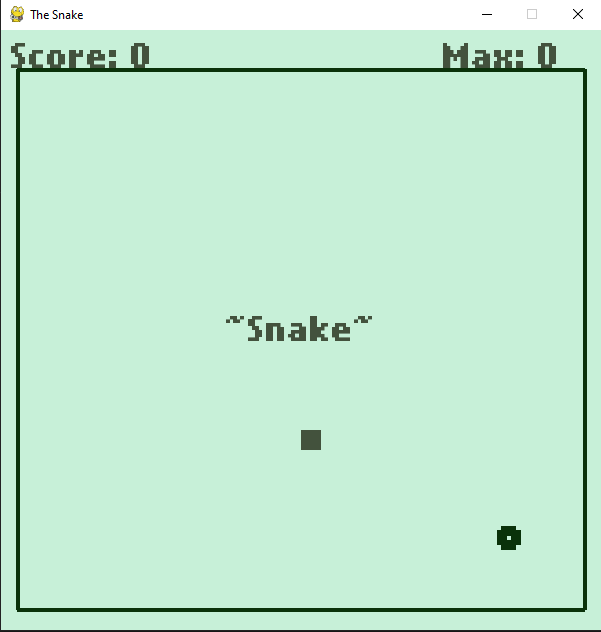
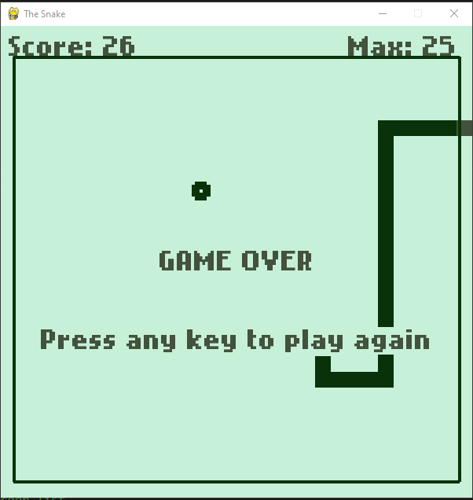

# Juego Snake

Based on the cellphone game, **Snake** (found in Nokia phones in the 90's).
Original project was done for the course "The Art of Doing: Video Game Creation with Python and Pygame (Michael Eramo, 2021, Pack)
Original Project: [Michael Eramo's repository](https://github.com/PacktPublishing/The-Art-of-Doing-Video-Game-Creation-With-Python-and-Pygame)

# Improvements

I started doing the game for the tutorial, but added some additional features and bugfixes

- added walls
- fixed wrong collision at the left and lower wall
- added max score

## Soon:

- Start Screen
- Selection of speed/difficulty
- Lives
- Selection of snake colors/style

# Screenshots

